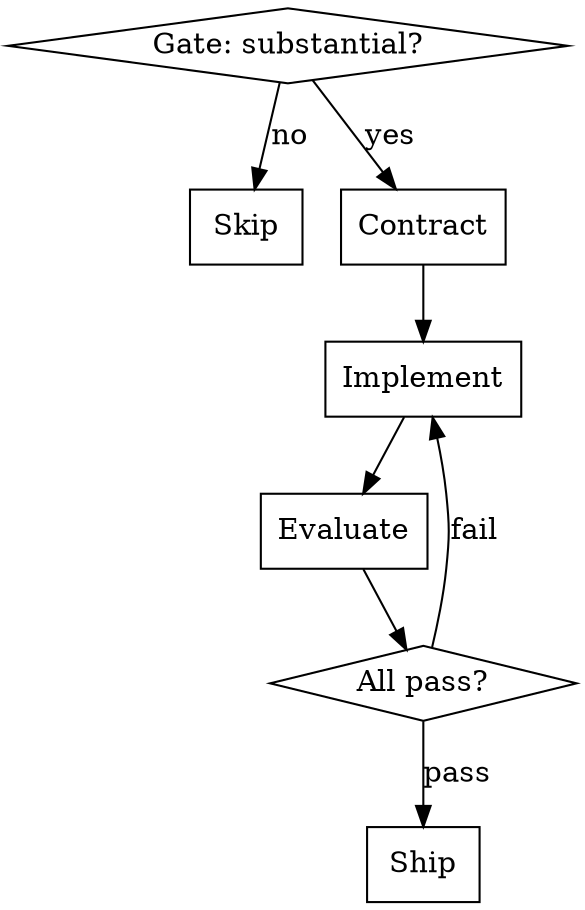

# Harness

"Planner → Generator → Evaluator" pipeline using existing superpowers and Playwright skills. The key insight: **the agent that builds should never be the agent that evaluates.**

## When NOT to Use — Say So

If the task is any of these, say "This is faster without the harness" and help directly:

- Single file edit, bug fix with clear cause, refactoring, config change, documentation

This gate is not optional.

## Flow



Copy this checklist and track progress:

```
Harness Progress:
- [ ] Phase 0: Gate — confirm task is substantial (3+ files)
- [ ] Phase 1: Contract — requirements, worktree, criteria, plan
- [ ] Phase 2: Implement — parallel/sequential execution
- [ ] Phase 3: Evaluate — independent subagent verification
- [ ] Phase 4: Ship — PR with criteria checklist
```

---

## Phase 0 — Gate

Use `Glob`/`Grep` to scan how many files/components are affected. If 3+ files across multiple concerns → proceed. Otherwise → skip.

---

## Phase 1 — Contract

Define what "done" means before writing any code.

1. **Explore requirements** — invoke `superpowers:brainstorming`
2. **Create worktree** — invoke `superpowers:using-git-worktrees`
3. **Write acceptance criteria** — verifiable criteria as JSON, tagged `[browser]` if visual verification needed. Use `AskUserQuestion` for structured approval.
4. **Create progress file** — write `.claude/harness/progress.json` (see [progress-schema.md](progress-schema.md) for schema)
5. **Track tasks** — use `TaskCreate` for each plan task (visible in status line)
6. **Write plan** — invoke `superpowers:writing-plans` with criteria as constraints

### Criteria Rules

- **Never delete or modify a criterion's description** — only add new ones
- **Status changes reserved for Evaluator** (Phase 3) — implementation agent cannot set "pass"
- **`["browser"]` tag** → Playwright verification required

---

## Phase 2 — Implementation

1. Update progress.json `phase` to `"implementation"`
2. Analyze task dependencies in the plan
3. **Independent tasks** → `superpowers:dispatching-parallel-agents` with `isolation: "worktree"` per subagent
4. **Dependent tasks** → `superpowers:executing-plans` or `superpowers:subagent-driven-development`
5. After each task → update `current_task`, use `TaskUpdate`, run build/lint via `superpowers:verification-before-completion`

The implementation agent must not mark any criterion as "pass".

### Returning from failed evaluation

Do NOT re-implement everything — only fix what failed:

1. Read `eval_history[-1].failures` — each has a `note` explaining what went wrong
2. Use `Grep` to locate relevant code, `Edit` to fix
3. Confirm build/lint still pass
4. Return to Phase 3

---

## Phase 3 — Evaluation

A **separate subagent** verifies work against acceptance criteria. See [evaluator-prompt.md](evaluator-prompt.md) for the full dispatch template.

### Dispatch

Use `Agent` tool to spawn the evaluator subagent with:
- Path to progress.json and plan file
- Evidence rules: no "should work", no "code looks correct" — run the actual check
- For `[browser]` criteria: use Playwright MCP tools (`browser_navigate`, `browser_snapshot`, `browser_take_screenshot`, `browser_click`, `browser_fill_form`, `browser_file_upload`)
- Update progress.json with pass/fail + evidence note for every criterion

### Feedback Loop

After evaluation, append to `eval_history`:

```json
{
  "round": 1,
  "timestamp": "ISO-8601",
  "results": { "pass": 4, "fail": 1 },
  "failures": [{ "id": 2, "description": "...", "note": "evidence..." }]
}
```

- **Any fail** → use `AskUserQuestion` with options: Fix and re-evaluate / Adjust criteria / Abort. If fix → Phase 2 with failure list.
- **All pass** → dispatch `superpowers:requesting-code-review` subagent, then Phase 4.
- **Same criterion fails 3 rounds** → stop looping, ask user for guidance.

---

## Phase 4 — Ship

1. Update progress.json `phase` to `"ship"`
2. Verify all criteria pass
3. Organize commits
4. Create PR via `gh pr create`:

```markdown
## Summary
{task description}

## Acceptance Criteria
- [x] criterion 1
- [x] criterion 2

## Evaluation
{N} rounds, all criteria passed

## Plan
See: `{plan_file}`
```

5. Delete progress.json
6. Share PR URL

---

## Resuming

If `.claude/harness/progress.json` exists when `/harness` is invoked:

1. Read progress file
2. Show phase, criteria status, eval history
3. Use `AskUserQuestion`: Resume / Discard and start fresh / Cancel
4. Resume → recreate `TaskCreate` entries, continue from recorded phase
